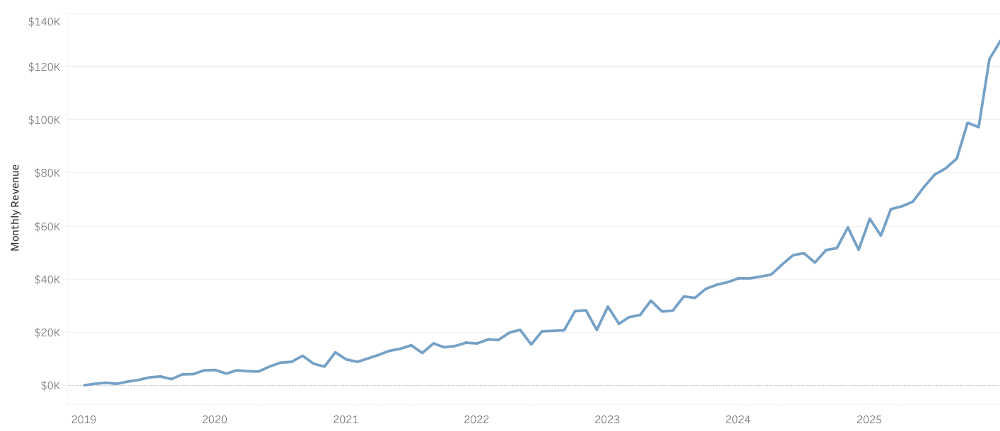
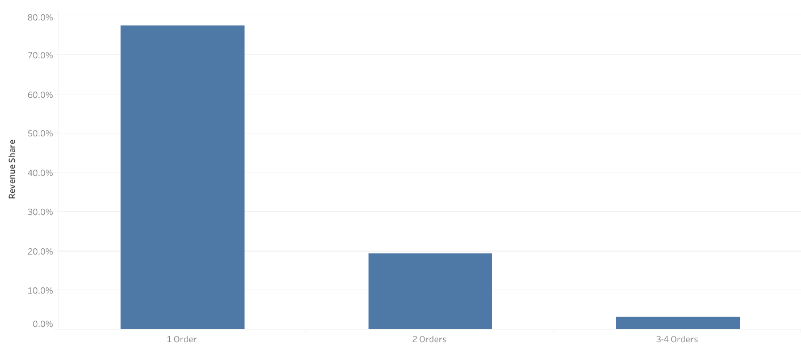
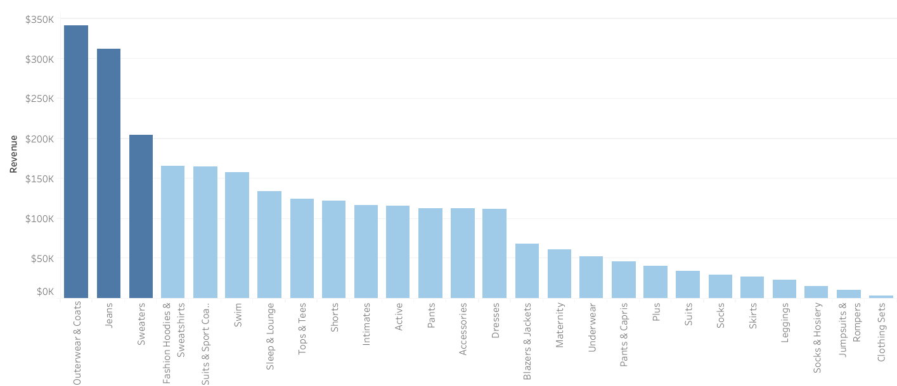
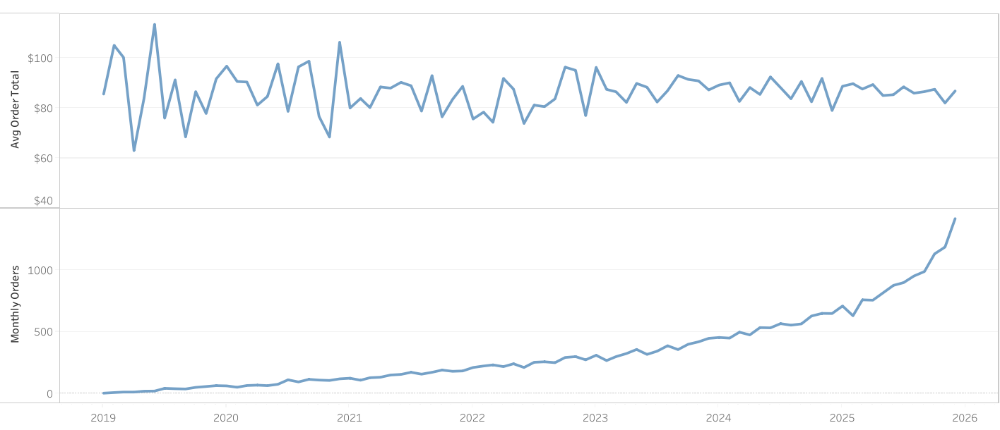

# Sales Performance & Customer Behavior Analysis (BigQuery + Tableau)

## Project Overview

This project analyzes sales performance and customer purchasing behavior using the **theLook eCommerce** public dataset available in Google BigQuery.

The analysis focuses on identifying revenue trends, understanding customer purchasing patterns, and determining which product categories and customer segments contribute most to overall business performance.

SQL was used for data extraction and transformation, and Tableau was used to create visualizations and support a business-focused analytical report.

---

## Objectives

The goals of this analysis were to:

* Evaluate overall sales performance over time
* Analyze customer purchasing behavior and order frequency
* Identify top-performing product categories
* Calculate key business metrics such as revenue trends and average order value
* Develop clear visualizations to communicate insights

---

## Tools & Technologies

* **SQL (Google BigQuery)**
* **Tableau**
* **Microsoft Word**
* **GitHub**

---

## Dataset

**Source:** Google BigQuery Public Dataset – theLook eCommerce
(https://console.cloud.google.com/marketplace/product/bigquery-public-data/thelook-ecommerce)

**Project ID:** bigquery-public-data
**Dataset ID:** thelook_ecommerce

The dataset contains customer, order, and product-level data from a fictional eCommerce company.

---

## Key Visualizations

### Monthly Revenue Trend



This visualization shows revenue trends over time and helps identify growth patterns and seasonality.

---

### Revenue by Customer Order Frequency



This analysis highlights how repeat customers contribute to overall revenue.

---

### Revenue by Product Category



This visualization identifies which product categories generate the most revenue.

---

### Average Order Value



This metric provides insight into typical customer spending behavior.

---

## Tableau Workbook

The Tableau workbook containing these visualizations is available here:

`tableau/ecommerce_book.twbx`

---

## SQL Queries

SQL scripts used for data extraction and analysis:

* `sql/01_overview.sql`
* `sql/02_sales_performance.sql`
* `sql/03_customer_analysis.sql`

These queries include:

* Data preparation
* Revenue analysis
* Customer behavior analysis

---

## Final Report

The complete written analysis is available here:

`reports/theLook_analysis.pdf`

This report includes detailed explanations, supporting visuals, and business conclusions.

---

## Repository Structure

```id="yzp0cy"
sales-performance-customer-behavior-analysis-bigquery-tableau/

├── sql/
├── tableau/
├── reports/
├── images/
├── data/
└── README.md
```

---

## Skills Demonstrated

* SQL data analysis using BigQuery
* Data visualization using Tableau
* Business performance analysis
* Customer behavior analysis
* Analytical reporting

---

## Author

Ethan Long  
Aspiring Data Analyst  

[LinkedIn](https://www.linkedin.com/in/ethan-long-652165289/)

---
